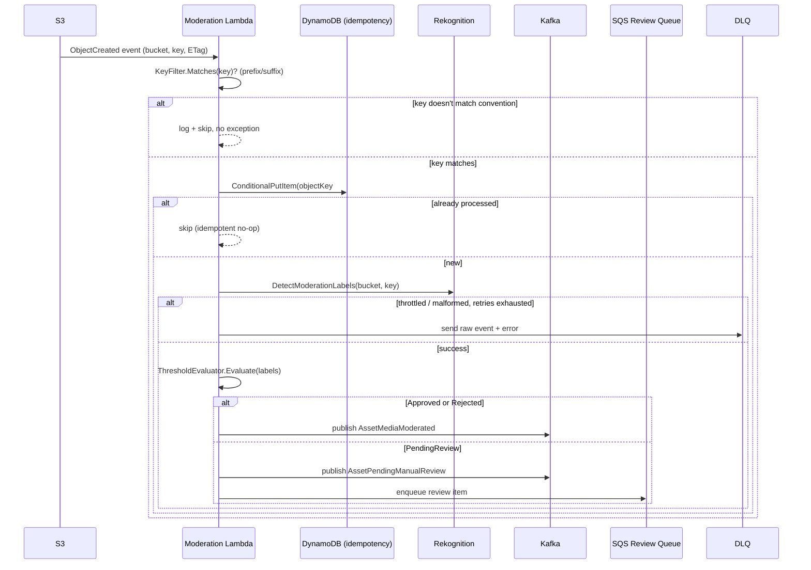

# E-02 Moderation Pipeline Design

**Spec**: `.specs/features/e02-moderation-pipeline/spec.md`
**Status**: Draft

**Correction (2026-07-22, post-implementation):** every mention of "MSK"/"MSK IAM auth" below was wrong. The `rentifyx-platform` sibling repo — not visible at design time — provisions a **self-hosted Kafka broker** (EC2, KRaft, PLAINTEXT, port 9092), not Amazon MSK; MSK Serverless was evaluated there and explicitly replaced (`rentifyx-platform` ADR-002). The `kafka-cluster:*` IAM statement this design specified was removed from `iac/modules/iam-roles/main.tf` — reachability is VPC/security-group based, and the bootstrap address is read via `terraform_remote_state` + SSM at deploy time (same pattern `rentifyx-identity-api` already uses), not a runtime IAM permission. Left the rest of this document as-is as a historical record of what was actually decided/built; see `CLAUDE.md`'s "Cross-repo infra" section for the corrected picture.

---

## Cross-Repo Verification (2026-07-22)

Re-checked `rentifyx-asset-registry-api` directly before designing (not just trusting the spec's prior notes):

- `IMediaStorageService` (`Domain/Interfaces/Media/IMediaStorageService.cs`) is still interface-only — no `S3MediaStorageService` implementation exists anywhere in that repo. `PresignedUploadUrl(Url, S3Key)` is returned by the handler but the actual key format is never constructed in code (`RequestMediaUploadHandler` just forwards whatever the interface returns). **The `assets/{ownerId}/{assetId}/{filename}` convention this spec assumes is still unconfirmed** — nothing in the source contradicts or confirms it.
- `AssetMediaUploaded(AssetId, S3Key, DateTime OccurredAt)` — confirmed event shape, but it's a domain event, not yet published to Kafka (no Kafka producer/outbox code exists in that repo at all; M4 infra is still planned). Reconfirms: this Lambda cannot and should not wait on it.
- ADR-005 in that repo (`docs/decisions/005-media-upload-pre-validation.md`) confirms MIME/size are validated **before** the presigned URL is issued — so by the time an object lands in S3, it's already a validated image type/size. This Lambda doesn't need to re-validate MIME type defensively for security reasons, only to skip non-matching keys (thumbnails, derivatives) per the spec's edge case.
- No bucket name, bucket ARN, or Terraform S3 resource exists yet in either repo — `var.media_bucket_arn` in `iac/modules/iam-roles/main.tf:33` is already a variable input (not hardcoded), so the IAM module is ready to receive a real ARN once the bucket exists. Nothing to change there structurally.

## Local Repo State Check

- `src/Functions/Moderation/RentifyxAiServices.Moderation/Class1.cs` — placeholder only, no handler.
- `src/Shared/RentifyxAiServices.Shared/Class1.cs` — placeholder only. STATE.md's mention of `Shared/{Aws,Events,Kafka,Idempotency,Observability}` folders describes the *intended* project layout, not code that exists yet — confirmed by directory listing, only `Class1.cs` is present.
- `iac/modules/iam-roles/main.tf` — moderation role currently grants only `rekognition:DetectModerationLabels` and `s3:GetObject`. **Missing for this feature**: DynamoDB write (idempotency table), Kafka/MSK publish (verdict events), SQS send (manual review queue + DLQ). These are new IAM statements this feature must add — flagged as a task, not assumed pre-existing.
- `iac/modules/{lambda-moderation,s3-trigger,kafka-event-source-mapping}` — do not exist yet (confirmed via glob), matches STATE.md's Open Items.

---

## Architecture Overview

Single-purpose Lambda, triggered by S3 `ObjectCreated`, synchronous within one invocation (no async fan-out): validate key → idempotency check → Rekognition call → threshold verdict → publish (Kafka and/or SQS) → DLQ on unrecoverable failure. No new AWS service beyond what's already named in ADR-AI-001/002 (S3, Rekognition, DynamoDB, Kafka, SQS).



---

## Code Reuse Analysis

### Existing Components to Leverage

Nothing yet exists to reuse in this repo (Shared is a placeholder). This feature is what *creates* the reusable Shared pieces future features (Enrichment, Dedupe) will build on. No `.specs/codebase/CONCERNS.md` exists — brownfield concerns doc not applicable at this stage.

| Component | Location | How to Use |
|---|---|---|
| `var.media_bucket_arn` input | `iac/modules/iam-roles/variables.tf` | Already parameterized — pass the real bucket ARN once known, no module change needed for that part |
| Test project scaffolding | `tests/RentifyxAiServices.Moderation.Tests`, `tests/RentifyxAiServices.Integration.Tests` | Already wired into the `.slnx`; add real tests here instead of new projects |
| `tests/Directory.Build.props` | repo root | Already suppresses test-convention analyzers; new test files inherit it automatically |

### Integration Points

| System | Integration Method |
|---|---|
| S3 | Lambda triggered by `ObjectCreated` event notification (native Lambda event source, not polling) |
| Rekognition | `DetectModerationLabels` via AWS SDK, synchronous call inside handler |
| DynamoDB | Conditional `PutItem` keyed on `{bucket}/{key}#{ETag}` with a TTL attribute — used purely for idempotency, not as a system of record |
| Kafka (MSK) | Producer publishes `AssetMediaModerated` / `AssetPendingManualReview` — versioned event contracts live in Shared |
| SQS | Manual review queue receives review-item metadata; separate SQS DLQ receives failed Rekognition invocations after retry exhaustion |
| CloudWatch | Alarm on review-queue depth (`ApproximateNumberOfMessagesVisible` > threshold for 1h) — infra-only, no application code |

---

## Components

### `ModerationHandler` (Lambda entrypoint)

- **Purpose**: Thin entrypoint — deserializes the S3 event, delegates to `ModerationService`, no logic inline (per repo convention).
- **Location**: `src/Functions/Moderation/RentifyxAiServices.Moderation/ModerationHandler.cs`
- **Interfaces**:
  - `Task FunctionHandler(S3Event s3Event, ILambdaContext context)` — Lambda runtime entrypoint
- **Dependencies**: `IModerationService` (DI-registered)
- **Reuses**: none yet (first real handler in the repo)

### `ModerationService`

- **Purpose**: Orchestrates the per-object flow: key filter → idempotency → Rekognition → threshold → publish.
- **Location**: `src/Functions/Moderation/RentifyxAiServices.Moderation/ModerationService.cs`
- **Interfaces**:
  - `Task ProcessAsync(S3EventNotification.S3EventNotificationRecord record, CancellationToken ct)` — one record, one object
- **Dependencies**: `IKeyConventionFilter`, `IIdempotencyStore`, `IRekognitionModerationClient`, `IThresholdEvaluator`, `IModerationEventPublisher`
- **Reuses**: `Shared.Events` contracts, `Shared.Idempotency`, `Shared.Aws` clients (all net-new in this feature, but placed in Shared so Enrichment/Dedupe can reuse the idempotency and event-publish patterns later)

### `IKeyConventionFilter` / `AssetKeyConventionFilter`

- **Purpose**: Confirms an S3 key matches the assumed `assets/{ownerId}/{assetId}/{filename}` prefix convention; rejects thumbnails/derivatives/malformed keys without throwing.
- **Location**: `src/Functions/Moderation/RentifyxAiServices.Moderation/AssetKeyConventionFilter.cs`
- **Interfaces**:
  - `bool Matches(string key)` 
- **Dependencies**: none (pure function over the key string)
- **Reuses**: none — isolated on purpose, since this convention is the one unconfirmed assumption in the whole design (see spec's Reality Check) and needs to be swappable/patchable in one place once `asset-registry-api` confirms the real format.

### `IIdempotencyStore` / `DynamoDbIdempotencyStore`

- **Purpose**: Conditional write to DynamoDB keyed on `{bucket}/{key}#{ETag}`; returns whether this is a first-seen event.
- **Location**: `src/Shared/RentifyxAiServices.Shared/Idempotency/`
- **Interfaces**:
  - `Task<bool> TryMarkProcessedAsync(string idempotencyKey, TimeSpan ttl, CancellationToken ct)` — `true` if this call claimed it (first time), `false` if already processed
- **Dependencies**: DynamoDB table (name via config/env var), AWS SDK `IAmazonDynamoDB`
- **Reuses**: none in-repo; placed in Shared since Enrichment will very likely need the same conditional-write idempotency pattern

### `IRekognitionModerationClient` / `RekognitionModerationClient`

- **Purpose**: Wraps `AmazonRekognitionClient.DetectModerationLabelsAsync`, adds retry/backoff for throttling, surfaces a typed result (labels + confidences) or a typed failure.
- **Location**: `src/Functions/Moderation/RentifyxAiServices.Moderation/RekognitionModerationClient.cs`
- **Interfaces**:
  - `Task<ModerationScanResult> ScanAsync(string bucket, string key, CancellationToken ct)`
- **Dependencies**: `IAmazonRekognition`, retry policy (Polly or SDK-native retry — confirm during Tasks phase, not assumed here per Knowledge Verification Chain)
- **Reuses**: none

### `IThresholdEvaluator` / `ThresholdEvaluator`

- **Purpose**: Pure function mapping Rekognition confidence to `Verdict` (`Approved`/`PendingReview`/`Rejected`) per MOD-02's boundaries.
- **Location**: `src/Functions/Moderation/RentifyxAiServices.Moderation/ThresholdEvaluator.cs`
- **Interfaces**:
  - `Verdict Evaluate(IReadOnlyList<ModerationLabel> labels)`
- **Dependencies**: none — thresholds as named constants (90%, 60%), referencing ADR-AI-003 once written
- **Reuses**: none; kept pure/isolated deliberately for the boundary unit tests the spec calls for (59/60/90/90.1/no-labels)

### `IModerationEventPublisher` / `KafkaModerationEventPublisher`

- **Purpose**: Publishes `AssetMediaModerated` or `AssetPendingManualReview` to Kafka; enqueues to SQS review queue when `PendingReview`.
- **Location**: `src/Shared/RentifyxAiServices.Shared/Kafka/` (publisher) + `src/Functions/Moderation/RentifyxAiServices.Moderation/` (SQS enqueue, moderation-specific)
- **Interfaces**:
  - `Task PublishAsync(AssetMediaModerated evt, CancellationToken ct)`
  - `Task PublishAsync(AssetPendingManualReview evt, CancellationToken ct)`
- **Dependencies**: Kafka producer (Confluent.Kafka or MSK IAM auth client — confirm library choice during Tasks), SQS client for review queue
- **Reuses**: none; the Kafka producer wrapper belongs in Shared so Enrichment reuses it for `AssetEnrichmentSuggested`

---

## Data Models

### `ModerationScanResult` (internal, not published)

```csharp
public sealed record ModerationScanResult(
    IReadOnlyList<ModerationLabel> Labels,
    bool Succeeded,
    string? FailureReason);

public sealed record ModerationLabel(string Name, float Confidence);
```

### `AssetMediaModerated` (published event, Shared.Events, versioned)

```csharp
public sealed record AssetMediaModerated(
    Guid AssetId,
    Verdict Verdict,
    IReadOnlyList<ModerationLabel> Labels,
    float TopConfidence,
    DateTimeOffset Timestamp,
    int SchemaVersion = 1);
```

### `AssetPendingManualReview` (published event, Shared.Events, versioned)

```csharp
public sealed record AssetPendingManualReview(
    Guid AssetId,
    IReadOnlyList<ModerationLabel> Labels,
    float TopConfidence,
    DateTimeOffset Timestamp,
    int SchemaVersion = 1);
```

**Relationships**: Both carry `AssetId` (extracted from the S3 key per the assumed convention — this is the one field whose extraction breaks if the key convention assumption turns out wrong). `Verdict` is a shared enum (`Approved`, `Rejected`, `PendingReview`) in `Shared.Events`.

---

## Error Handling Strategy

| Error Scenario | Handling | Downstream Impact |
|---|---|---|
| S3 key doesn't match asset convention | `AssetKeyConventionFilter.Matches` returns false, log at Info, return without exception | No event published, no Rekognition call, no cost incurred |
| Same object (same ETag) triggers twice | `DynamoDbIdempotencyStore` conditional write fails (already exists), skip | No duplicate event published |
| Rekognition throttled | Retry with backoff (attempt count/policy confirmed in Tasks phase) | Delays verdict, no user-visible impact within retry budget |
| Rekognition fails after retries exhausted, or malformed image | Send to DLQ (SQS) with original event + error context, do not publish any verdict event | `asset-registry-api` sees no verdict — needs its own timeout/retry-visibility strategy (out of scope here, note for cross-repo follow-up) |
| DynamoDB idempotency store unavailable | Fail the invocation (let Lambda retry naturally via S3 event redelivery) rather than silently proceeding without idempotency | Rare; acceptable since S3 event retries exist |

---

## Tech Decisions (only non-obvious ones)

| Decision | Choice | Rationale |
|---|---|---|
| Idempotency key shape | `{bucket}/{key}#{ETag}` | ETag changes if the same key is overwritten with different content — keying on key alone would wrongly skip a legitimate re-upload |
| Where key-convention logic lives | Isolated `IKeyConventionFilter`, not inlined in the service | It's the one unconfirmed cross-repo assumption (see spec) — needs to be a single, easily-patched seam once the real format is confirmed |
| Retry library for Rekognition throttling | Not decided here — flagged for Tasks phase research (Polly vs SDK-native retry) per Knowledge Verification Chain; do not fabricate a choice in Design | N/A — deliberately deferred |
| Kafka client library | Not decided here — same reasoning, confirm via Context7/web research in Tasks phase | N/A — deliberately deferred |
| IAM policy additions | New statements needed for DynamoDB write, Kafka/MSK publish, SQS send — added to `iac/modules/iam-roles/main.tf`'s `moderation` policy document, still one dedicated role (ADR-AI-002 unaffected) | Confirmed gap found by reading current `main.tf`, not assumed |

---

## Open Questions Carried From Spec (unchanged, still open)

- S3 key convention (`assets/{ownerId}/{assetId}/{filename}`) needs confirmation from `asset-registry-api` team before `iac/modules/s3-trigger` is wired to a real bucket (spec's flagged blocker, re-verified true as of this design pass — no code in that repo confirms or denies it).
- ADR-AI-003 (thresholds) and ADR-AI-004 (hybrid moderation strategy) still need writing — referenced by `ThresholdEvaluator` but not yet accepted as ADRs.

---

## Tips followed

- Loaded spec.md first; no context.md exists for this feature (no discuss phase was triggered).
- Verified against both repos' actual source rather than trusting STATE.md/spec.md claims at face value — found one concrete gap (IAM policy) neither doc had flagged.
- Retry library and Kafka client choices deliberately left open rather than fabricated — to be resolved with research during Tasks/Execute per the Knowledge Verification Chain.
