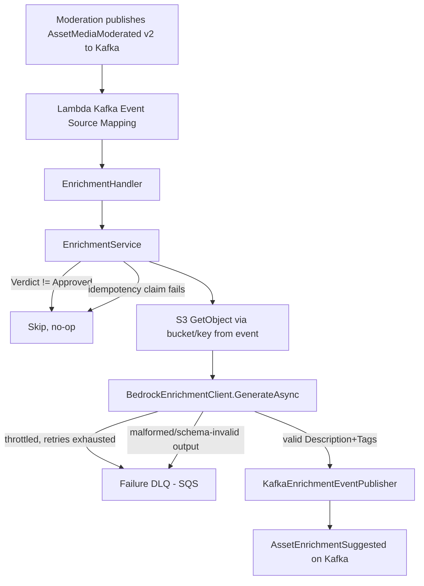

# E-03 Enrichment Pipeline Design

**Spec**: `.specs/features/e03-enrichment-pipeline/spec.md`
**Status**: Approved

---

## Research (Knowledge Verification Chain)

Followed Codebase → Project docs → Context7 → Web search, in order:

1. **Bedrock API shape (Context7, `/aws/aws-sdk-net`)**: the modern .NET SDK surface is `IAmazonBedrockRuntime.ConverseAsync(ConverseRequest)` (the **Converse API**), not the older raw-JSON `InvokeModel` CLAUDE.md speculatively mentioned before this feature was implemented. Converse is provider-agnostic and models multimodal content as a list of `ContentBlock`s on a `Message`, with `ConverseRequest.AdditionalModelRequestFields` as the escape hatch for provider-specific params (e.g. Claude's extended thinking). This design uses Converse, not InvokeModel — **deviation from CLAUDE.md's current wording, to be corrected there once this lands**.
2. **Exact `ContentBlock.Image`/`ImageBlock` and `ToolConfig` field shapes**: Context7 confirmed `ConverseRequest`/`ConverseResponse`/`ContentBlock` exist and are the right surface, but didn't return the exact property names for image content blocks or tool-forced structured output. **Not fabricated here** — Tasks phase must confirm exact shapes via the restored `AWSSDK.BedrockRuntime` package's model files (`<nuget-cache>/awssdk.bedrockruntime/<version>/lib/<tfm>/*.xml`, grep `name="T:Amazon.BedrockRuntime.Model.ImageBlock"` / `ToolConfig`), same convention this repo already used for `Amazon.Lambda.S3Events` in E-02.
3. **NuGet pin check (flat-container API)**: `AWSSDK.BedrockRuntime` is currently pinned at `4.0.14.0` in `Directory.Packages.props` — **that exact version does not exist** on NuGet.org (versions jump `4.0.14` → `4.0.14.1`...`4.0.14.6` → `4.0.15`; no `.0` suffix release). Same stale-pin pattern CONCERNS.md already flags from E-02. Latest real version: `4.0.100.6`. Also confirmed `Amazon.Lambda.KafkaEvents` exists on NuGet (latest `3.0.0`) — needed new, not yet in `Directory.Packages.props`.
4. **Bedrock model ID (web search, aws.amazon.com / docs.aws.amazon.com, July 2026 results)**: current-generation Claude on Bedrock is **Claude Sonnet 5**, cross-region inference profile ID `us.anthropic.claude-sonnet-5` (regional variants exist for EU/AU/JP). This is the model this design targets, per your P1 decision (Claude via Bedrock).
5. **Bedrock region availability for `sa-east-1`**: not confirmed either way by the research above — flagged as an open question below, not assumed.

---

## Architecture Overview

Enrichment mirrors Moderation's layered shape (thin handler → orchestrator → seam interfaces), but is **Kafka-triggered**, not S3-triggered — it consumes `AssetMediaModerated` (published by Moderation) via AWS Lambda's native Kafka event source mapping for self-managed Kafka, which is exactly what the already-scaffolded (empty) `iac/modules/kafka-event-source-mapping` was reserved for.



---

## Code Reuse Analysis

### Existing Components to Leverage

| Component | Location | How to Use |
|---|---|---|
| `DynamoDbIdempotencyStore` / `IIdempotencyStore` | `src/Shared/.../Idempotency` | Reuse directly — same `TryMarkProcessedAsync(key, ttl)` pattern, keyed by `AssetId` instead of `{bucket}/{key}#{eTag}` |
| `KafkaEventPublisher<T>` | `src/Shared/.../Kafka` | Reuse directly for `KafkaEventPublisher<AssetEnrichmentSuggested>` — already generic, already has the `JsonStringEnumConverter` fix from E-02's integration-test findings |
| Retry/backoff shape | `RekognitionModerationClient` (`src/Functions/Moderation/.../Rekognition`) | Same shape (fixed attempt count, exponential backoff, throttling-specific catch) for `BedrockEnrichmentClient` — exact Bedrock throttling exception type TBD in Tasks (likely `Amazon.BedrockRuntime.Model.ThrottlingException`, needs confirmation) |
| Failure-DLQ SQS pattern | `ModerationService.SendToFailureDlqAsync` | Same shape — a dedicated failure DLQ per function (ADR-AI-004 precedent), not the shared review queue |
| Thin handler / testable service split | `ModerationHandler` → `ModerationService` | Same layering for `EnrichmentHandler` → `EnrichmentService` |
| Global `<Using>` csproj items | `RentifyxAiServices.Moderation.csproj` | Same pattern for the Enrichment csproj's own sub-namespaces, learned the hard way from the 2026-07-23 build regression — write per-file `using`s or global csproj `<Using>`s, but verify with a real build before committing either way |

### Integration Points

| System | Integration Method |
|---|---|
| Kafka (consume) | AWS Lambda Kafka event source mapping (self-managed Kafka, `Amazon.Lambda.KafkaEvents` package, new dependency) — reads `AssetMediaModerated` from the same topic Moderation publishes to (`KAFKA_MODERATED_TOPIC`) |
| Kafka (publish) | `KafkaEventPublisher<AssetEnrichmentSuggested>` via `Confluent.Kafka` producer, same as Moderation |
| S3 (read) | `IAmazonS3.GetObjectAsync(bucket, key)` — bucket/key now come from the event itself (v2 contract change), not re-derived |
| Bedrock | `IAmazonBedrockRuntime.ConverseAsync` |
| DynamoDB | Same idempotency table concept as Moderation — **open question**: same physical table with a key prefix, or a separate table? (see Tech Decisions) |
| SQS | New failure DLQ, mirroring Moderation's (not the same queue — different function, different failure semantics, ADR-AI-002 isolation) |

---

## Components

### `AssetMediaModerated` (Shared, v2 — contract change)

- **Purpose**: Carry enough data for Enrichment to fetch the same image Moderation scanned, without a synchronous lookup.
- **Location**: `src/Shared/RentifyxAiServices.Shared/Events/AssetMediaModerated.cs`
- **Change**: add `string Bucket`, `string Key`; bump `SchemaVersion` default `1` → `2`. Additive per CLAUDE.md's "Shared contracts must stay versioned and additive-only."
- **Producer change**: `ModerationService.ProcessAsync` already has `bucket`/`key` in scope — pass them into the `AssetMediaModerated` constructor call.
- **Consumer impact**: none for existing Moderation tests (new fields, no removed ones); `KafkaModerationEventPublisherTests`/`ModerationServiceTests` need two extra constructor args.

### `AssetEnrichmentSuggested` (Shared, new)

- **Purpose**: Structured description + tags suggestion for `asset-registry-api` to apply.
- **Location**: `src/Shared/RentifyxAiServices.Shared/Events/AssetEnrichmentSuggested.cs`
- **Shape**: `record AssetEnrichmentSuggested(Guid AssetId, string Description, IReadOnlyList<string> Tags, DateTimeOffset Timestamp, int SchemaVersion = 1)`

### `EnrichmentHandler` (Lambda entrypoint)

- **Purpose**: Thin entrypoint — deserialize the Kafka event batch, delegate per-record.
- **Location**: `src/Functions/Enrichment/RentifyxAiServices.Enrichment/EnrichmentHandler.cs`
- **Interfaces**: `FunctionHandler(KafkaEvent kafkaEvent, ILambdaContext context): Task`
- **Dependencies**: `Amazon.Lambda.KafkaEvents` (new package), `EnrichmentService`
- **Reuses**: `ModerationHandler`'s thin-entrypoint + `BuildService()` composition-root shape

### `EnrichmentService` (orchestrator)

- **Purpose**: Verdict filter → idempotency → S3 fetch → Bedrock call → publish/DLQ.
- **Location**: `src/Functions/Enrichment/RentifyxAiServices.Enrichment/EnrichmentService.cs`
- **Interfaces**: `ProcessAsync(AssetMediaModerated moderatedEvent, CancellationToken): Task`
- **Dependencies**: `IIdempotencyStore`, `IAmazonS3`, `IBedrockEnrichmentClient`, `IEnrichmentEventPublisher`, `IAmazonSQS` (failure DLQ)
- **Reuses**: `ModerationService`'s structure almost line-for-line (ENR-01, ENR-02, ENR-04, ENR-05, ENR-06, ENR-07)

### `IBedrockEnrichmentClient` / `BedrockEnrichmentClient`

- **Purpose**: Own the Converse API call, retry/backoff, prompt construction, response schema validation.
- **Location**: `src/Functions/Enrichment/RentifyxAiServices.Enrichment/Bedrock/`
- **Interfaces**: `GenerateAsync(byte[] imageBytes, CancellationToken): Task<EnrichmentResult>`
- **Dependencies**: `IAmazonBedrockRuntime`
- **Reuses**: `RekognitionModerationClient`'s retry-loop shape (ENR-05)
- **Addresses P3 (ENR-10, ENR-11)**: system/instruction prompt built as a separate `Message` from the image content block (role separation, never string-concatenated); forces structured output via `ToolConfig` (exact shape TBD in Tasks) so the model can't return free-form prose where tags are expected — a schema mismatch is a hard failure, not a best-effort parse.
- **Addresses P2 (ENR-08)**: `InferenceConfiguration.MaxTokens` set to a fixed, configurable cap.

### `EnrichmentResult` (internal record, not published)

- **Location**: `src/Functions/Enrichment/RentifyxAiServices.Enrichment/Bedrock/EnrichmentResult.cs`
- **Shape**: `record EnrichmentResult(string? Description, IReadOnlyList<string> Tags, bool Succeeded, string? FailureReason)`
- **Reuses**: `ModerationScanResult`'s success/failure-reason shape

### `IEnrichmentEventPublisher` / `KafkaEnrichmentEventPublisher`

- **Purpose**: Publish `AssetEnrichmentSuggested`.
- **Location**: `src/Functions/Enrichment/RentifyxAiServices.Enrichment/Publishing/`
- **Reuses**: `KafkaModerationEventPublisher`'s shape, minus the SQS review-queue side-effect (Enrichment has no manual-review concept)

---

## Data Models

### `AssetMediaModerated` (v2)

```csharp
public sealed record AssetMediaModerated(
    Guid AssetId,
    Verdict Verdict,
    IReadOnlyList<ModerationLabel> Labels,
    float TopConfidence,
    DateTimeOffset Timestamp,
    string Bucket,
    string Key,
    int SchemaVersion = 2);
```

**Relationships**: published by Moderation, consumed by Enrichment (this feature) and — eventually — `asset-registry-api`.

### `AssetEnrichmentSuggested`

```csharp
public sealed record AssetEnrichmentSuggested(
    Guid AssetId,
    string Description,
    IReadOnlyList<string> Tags,
    DateTimeOffset Timestamp,
    int SchemaVersion = 1);
```

**Relationships**: published by Enrichment (this feature), consumed by `asset-registry-api` (out of scope here, tracked as that repo's own backlog item).

---

## Error Handling Strategy

| Error Scenario | Handling | Downstream Impact |
|---|---|---|
| `Verdict != Approved` | Skip, log info, no Bedrock call, no DLQ (not a failure) | No event published for this asset |
| Duplicate Kafka delivery (same `AssetId` already claimed) | Idempotency short-circuit before any Bedrock/S3 call | No duplicate `AssetEnrichmentSuggested` |
| Bedrock throttled | Retry w/ exponential backoff (same shape as Rekognition), DLQ after retries exhausted | Delayed or DLQ'd, never silently dropped |
| S3 object missing (deleted between Moderation and Enrichment) | Catch not-found, DLQ with clear reason | DLQ'd, not an unhandled exception |
| Bedrock output fails schema validation (ToolConfig mismatch, empty tool-use block) | Treat as failure, DLQ, never publish | No malformed event published |
| Bedrock model ARN/region unset at cold start | Fail fast (same posture as `ModerationHandler`'s required env vars) | Lambda cold-start failure, visible in CloudWatch, not a silent no-op |

---

## Tech Decisions (only non-obvious ones)

| Decision | Choice | Rationale |
|---|---|---|
| Bedrock API surface | Converse API (`ConverseAsync`), not raw `InvokeModel` | Provider-agnostic content-block model, native multimodal + tool-forced structured output, confirmed as the modern .NET SDK surface via Context7 — CLAUDE.md's "InvokeModel" mention predates real implementation and should be corrected once this lands |
| Kafka consumption mechanism | AWS Lambda Kafka event source mapping (`Amazon.Lambda.KafkaEvents`), not a long-running `Confluent.Kafka` consumer loop | Lambdas are invoke-driven, not long-running processes; this is exactly what `iac/modules/kafka-event-source-mapping` was already scaffolded for (previously "not needed yet" since Moderation is S3-triggered — now it's needed) |
| `AssetMediaModerated` gets `Bucket`/`Key` | Extend the event (v2) rather than a synchronous lookup to `asset-registry-api` | Confirmed with you — keeps the event-only architecture principle intact, `ModerationService` already has both values for free |
| Idempotency table: shared with Moderation or separate | **Separate table** (your decision) — full isolation between Lambdas, matches ADR-AI-002's spirit. Neither table is provisioned yet (STATE.md gap); this adds a second un-provisioned resource rather than reusing one | — |
| Failure DLQ: new queue or reuse Moderation's `moderation-failure-dlq` | **New, Enrichment-specific DLQ** (your decision) — mirrors ADR-AI-002/004's per-function isolation, keeps Bedrock failures from blurring the signal in Moderation's Rekognition-failure-shaped queue | — |
| Bedrock region (`sa-east-1` vs a cross-region inference profile) | **Open — not confirmed by research above.** `us.anthropic.claude-sonnet-5` is a US-region inference profile ID; whether Bedrock/Claude Sonnet 5 is directly callable from `sa-east-1` or needs cross-region routing needs a real AWS console/docs check before Tasks, not assumed | — |

---

## Open Questions Resolved / Carried Into Tasks

1. ~~Idempotency table: shared or separate~~ — **resolved: separate table**, `iac/modules/enrichment-idempotency` (new, mirrors no existing module since Moderation's own table module doesn't exist yet either — both are new Terraform work).
2. ~~Failure DLQ: new or reused~~ — **resolved: new**, alongside a new `iac/modules/enrichment-review-queue`-equivalent (naming TBD in Tasks — Enrichment has no manual-review queue, only a failure DLQ, so this is smaller than `review-queue`).
3. Confirm `ContentBlock.Image`/`ImageBlock` and `ToolConfig` exact field names via the restored `AWSSDK.BedrockRuntime` 4.0.100.6 package XML docs (Tasks-phase, not guessed here).
4. Confirm Bedrock throttling exception type (`Amazon.BedrockRuntime.Model.ThrottlingException` assumed, not verified).
5. Confirm Bedrock region reachability from `sa-east-1` (cross-region inference profile vs direct).
6. `iac/modules/kafka-event-source-mapping` and `iac/modules/lambda-enrichment` still need to be written (mirroring `lambda-moderation`/`s3-trigger`'s pattern) — out of this design's code scope but required before this feature is deployable, same posture as E-02's Terraform.
