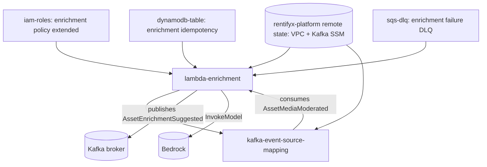

# Enrichment Pipeline IaC Design

**Spec**: `.specs/features/e03b-enrichment-iac/spec.md`
**Status**: Draft

---

## Architecture Overview

Five new/changed Terraform units, composed into the existing `iac/terraform/` root config alongside Moderation's:



Root config wiring mirrors Moderation's existing pattern exactly: each module's output feeds the next module's input variable, no module reaches across to another's internal resources directly.

---

## Code Reuse Analysis

### Existing Components to Leverage

| Component | Location | How to Use |
| --- | --- | --- |
| `lambda-moderation`'s VPC-attach pattern | `iac/modules/lambda-moderation/main.tf` | Copy verbatim: `terraform_remote_state` read of `rentifyx-platform`, `try()`-wrapped SSM lookup, egress-only SG, `public_subnets[0]` |
| `review-queue`'s bare-DLQ shape | `iac/modules/review-queue/main.tf` (`aws_sqs_queue.moderation_failure_dlq`) | Same shape for the new enrichment failure DLQ — no redrive policy, defaults for retention/visibility |
| `iam-roles`' per-Lambda policy document pattern | `iac/modules/iam-roles/main.tf` (`data.aws_iam_policy_document.enrichment`) | Add statements to the existing `enrichment` document, don't create a new role |
| `iac/terraform/` root composition pattern | `iac/terraform/main.tf` | Same wiring style (module output -> next module's variable) for the new modules |

### Integration Points

| System | Integration Method |
| --- | --- |
| `rentifyx-platform` (VPC + Kafka broker) | `data.terraform_remote_state.platform`, read once per module that needs it (both `lambda-enrichment` and `kafka-event-source-mapping` need VPC subnet/SG info; `kafka-event-source-mapping` additionally needs the bootstrap address for `self_managed_event_source.endpoints`) |
| `EnrichmentHandler` env var contract | Confirmed by reading `src/Functions/Enrichment/EnrichmentHandler.cs`'s `BuildService()`: `ENRICHMENT_IDEMPOTENCY_TABLE_NAME`, `ENRICHMENT_FAILURE_DLQ_URL`, `BEDROCK_REGION`, `KAFKA_ENRICHMENT_SUGGESTED_TOPIC`, `KAFKA_BOOTSTRAP_SERVERS` |
| `DynamoDbIdempotencyStore` key schema | Confirmed by reading `src/Shared/RentifyxAiServices.Shared/Idempotency/DynamoDbIdempotencyStore.cs`: partition key `IdempotencyKey` (String), item attribute `ExpiresAt` (Number, Unix seconds) backing a DynamoDB TTL config |

---

## Components

### `iac/modules/lambda-enrichment` (new)

- **Purpose**: Enrichment Lambda function — Kafka-triggered, VPC-attached, calls Bedrock
- **Location**: `iac/modules/lambda-enrichment/{main,variables,outputs}.tf`
- **Interfaces** (inputs): `prefix`, `enrichment_role_arn`, `lambda_package_path`, `lambda_handler` (default `RentifyxAiServices.Enrichment::RentifyxAiServices.Enrichment.EnrichmentHandler::FunctionHandler`), `lambda_runtime` (default `dotnet10`), `timeout`, `memory_size`, `idempotency_table_name`, `failure_dlq_url`, `bedrock_region` (default `us-east-1`), `kafka_enrichment_suggested_topic` (default `asset-enrichment-suggested`)
- **Interfaces** (outputs): `function_arn`, `function_name`, `security_group_id`, `subnet_ids` — the last two so `kafka-event-source-mapping` can reuse the same VPC placement instead of re-deriving it
- **Dependencies**: `iam-roles.enrichment_role_arn`, `rentifyx-platform` remote state, the new DynamoDB table and DLQ modules' outputs (passed in as variables, not looked up internally)
- **Reuses**: `lambda-moderation/main.tf`'s VPC/SG/remote-state block, copied and adapted (function name, role, env vars, handler)

### `iac/modules/kafka-event-source-mapping` (new)

- **Purpose**: Wires the Enrichment Lambda to consume Moderation's `AssetMediaModerated` topic from the self-managed Kafka broker
- **Location**: `iac/modules/kafka-event-source-mapping/{main,variables,outputs}.tf`
- **Interfaces** (inputs): `function_name` (from `lambda-enrichment.function_name`), `topics` (list, default `["asset-media-moderated"]` — matches `lambda-moderation`'s existing `kafka_moderated_topic` default so the two modules agree without cross-referencing), `starting_position` (default `TRIM_HORIZON`), `kafka_bootstrap_servers` (from the same SSM lookup `lambda-enrichment` already resolved, passed through rather than re-queried), `subnet_ids`/`security_group_id` (from `lambda-enrichment`'s outputs)
- **Interfaces** (outputs): `event_source_mapping_uuid`
- **Dependencies**: `lambda-enrichment`'s outputs; no direct `rentifyx-platform` remote-state read of its own — takes the resolved bootstrap address and VPC placement as inputs to avoid two modules independently querying the same remote state (per the "Integration Points" row above, actually the module DOES need its own VPC subnet/SG for `source_access_configuration`, but sources those values from `lambda-enrichment`'s outputs, not a second remote-state read)
- **Reuses**: nothing existing (first self-managed Kafka ESM in this repo) — confirmed shape via Context7 (`/hashicorp/terraform-provider-aws`, `aws_lambda_event_source_mapping`): `self_managed_event_source { endpoints = { KAFKA_BOOTSTRAP_SERVERS = "..." } }`, `self_managed_kafka_event_source_config { consumer_group_id = ... }`, `source_access_configuration` blocks of type `VPC_SUBNET` (one per subnet) and `VPC_SECURITY_GROUP`. No SASL/auth `source_access_configuration` entry needed — broker is PLAINTEXT (matches `iam-roles/main.tf`'s existing comment on why no `kafka-cluster:*` IAM action applies here)

### `iac/modules/dynamodb-table` (new, generic)

- **Purpose**: A minimal, reusable single-partition-key DynamoDB table module — closes the STATE.md gap that *no* table resource exists anywhere in `iac/`, for either Lambda
- **Location**: `iac/modules/dynamodb-table/{main,variables,outputs}.tf`
- **Interfaces** (inputs): `table_name`, `hash_key` (default `IdempotencyKey`), `hash_key_type` (default `S`), `ttl_attribute_name` (default `ExpiresAt`), `billing_mode` (default `PAY_PER_REQUEST` — no capacity planning done for either Lambda yet, on-demand avoids under/over-provisioning guesswork)
- **Interfaces** (outputs): `table_name`, `table_arn`
- **Dependencies**: none
- **Reuses**: nothing existing — deliberately generic (not named `enrichment-idempotency-table`) so Moderation's still-unbacked `idempotency_table_name` variable can adopt the same module later (Out of Scope in spec.md, but the module itself is built reusable now rather than needing a rewrite then)
- Instantiated in root config as `module.enrichment_idempotency_table { table_name = "${local.prefix}-enrichment-idempotency" }`

### `iac/modules/review-queue` (extended, not new)

- **Purpose**: Add the enrichment failure DLQ alongside the existing moderation review queue / DLQs, since this module already owns the SQS "queues for this repo" concern
- **Location**: `iac/modules/review-queue/main.tf` — add `resource "aws_sqs_queue" "enrichment_failure_dlq"` (bare, no redrive policy, same shape as `moderation_failure_dlq`), plus an `enrichment_failure_dlq_url`/`_arn` output pair
- **Dependencies**: none new
- **Reuses**: existing `moderation_failure_dlq` resource as the direct template (copy-paste-rename, same defaults)

### `iac/modules/iam-roles` (extended, not new)

- **Purpose**: Extend `data.aws_iam_policy_document.enrichment` with the three missing statements
- **Location**: `iac/modules/iam-roles/main.tf`, `variables.tf` (new input variables), `outputs.tf` (no change needed — role/policy already output)
- **New statements**:
  - `S3Read` — `s3:GetObject` on `${var.media_bucket_arn}/*` (same variable Moderation's policy already takes — Enrichment reads the same bucket, just a different key each time, resolved from the triggering Kafka event, not a static prefix)
  - `IdempotencyTableWrite` — `dynamodb:PutItem` on `var.enrichment_idempotency_table_arn` (new variable)
  - `FailureDlqSend` — `sqs:SendMessage` on `var.enrichment_failure_dlq_arn` (new variable)
- **Reuses**: `moderation`'s policy document as the structural template (same statement shape: `sid`/`effect`/`actions`/`resources`)

---

## Data Models

### DynamoDB idempotency table (generic module instance)

```
Table: {prefix}-enrichment-idempotency
  Partition key: IdempotencyKey (S)
  TTL: enabled on ExpiresAt (N, Unix seconds)
  Billing: PAY_PER_REQUEST
```

Matches `DynamoDbIdempotencyStore`'s `PutItem` shape exactly (`ConditionExpression = attribute_not_exists(IdempotencyKey)`), confirmed by reading the actual C# source, not assumed from Moderation's table (which uses the same store class but a separate table instance per CLAUDE.md's E-03 note).

**Relationships**: One instance for Enrichment (this feature). Moderation's own table instance is out of scope (spec.md), but would use the same module.

---

## Error Handling Strategy

| Error Scenario | Handling | User Impact |
| --- | --- | --- |
| `rentifyx-platform`'s Kafka SSM parameter doesn't exist yet (broker not applied) | `try()` around the SSM data source, same as `lambda-moderation` — resolves to `""` rather than failing `plan`/`apply` | `terraform plan` still succeeds; the Lambda would fail at cold start with an empty `KAFKA_BOOTSTRAP_SERVERS` until platform is applied — pre-existing risk pattern, not new |
| `kafka-event-source-mapping` applied before the Kafka topic exists on the broker | AWS-side failure at ESM creation/poll time, not a Terraform-time failure — out of scope for this module (topic provisioning isn't owned by any module in this repo) | `apply` may fail or the ESM may sit in a failed state; operational concern, documented as a known gap, not solved here |
| Two modules (`lambda-enrichment`, `kafka-event-source-mapping`) both needing VPC subnet/SG placement | `kafka-event-source-mapping` takes them as inputs from `lambda-enrichment`'s outputs instead of re-reading `rentifyx-platform`'s remote state itself | Avoids drift between the Lambda's own VPC placement and the ESM's poller placement being resolved from two independent reads |

---

## Tech Decisions (only non-obvious ones)

| Decision | Choice | Rationale |
| --- | --- | --- |
| Generic `dynamodb-table` module vs. an `enrichment`-specific one | Generic, single-partition-key module | STATE.md already flags that *no* table module exists for either Lambda; building it Enrichment-specific now would mean rewriting it when Moderation eventually adopts one — cheap to make generic today, adopting it for Moderation is still a separate follow-up (Out of Scope) |
| `kafka-event-source-mapping` re-reads `rentifyx-platform` remote state, or takes VPC/bootstrap values as inputs from `lambda-enrichment` | Takes them as inputs | Two independent remote-state reads of the same platform outputs risk silently diverging (e.g. subnet list order) if platform's outputs ever change shape; single source of truth is simpler and matches "each module owns exactly what it creates" already followed by `s3-trigger` (takes bucket/Lambda as variables rather than looking them up) |
| `billing_mode = PAY_PER_REQUEST` for the new table | On-demand | No traffic data exists yet for either Lambda (mirrors the "don't preemptively optimize" stance CLAUDE.md already takes on Native AOT) — switching to provisioned capacity later is a mechanical Terraform change, not a redesign |
| Enrichment failure DLQ lives in `iac/modules/review-queue`, not a new `iac/modules/enrichment-dlq` | Extend `review-queue` | That module already owns "SQS queues for this repo's Lambdas" as a concern (it has both `review` and `moderation_failure_dlq` today) — a same-shaped `enrichment_failure_dlq` sibling resource fits the existing module boundary better than a one-resource module named after a single Lambda |
| No `source_access_configuration` auth-type entry (e.g. `SASL_SCRAM_512_AUTH`) in the Kafka ESM | Omitted entirely | Broker is PLAINTEXT (confirmed in `iam-roles/main.tf`'s existing comment and `lambda-moderation`'s design) — only `VPC_SUBNET`/`VPC_SECURITY_GROUP` entries are needed; adding an unused auth-type block would be inventing infrastructure the broker doesn't support |

---

## Open Questions (carried into tasks.md as risk notes, not blockers)

- Whether the ESM's `self_managed_kafka_event_source_config.consumer_group_id` should be set explicitly (deterministic, survives Lambda replacement) or left to auto-generate — leaning explicit (`${var.prefix}-enrichment-consumer`) for operability, but not confirmed against any existing convention in this repo or `rentifyx-platform` since this is the first Kafka ESM built here.
