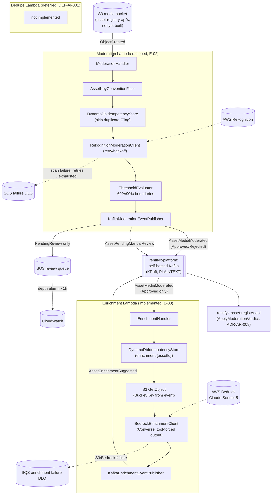

# RentifyX AI Services

[](https://github.com/eugeniobandeira/rentifyx-ai-services/actions/workflows/ci.yml)

[](LICENSE)
[](https://linkedin.com/in/eugeniobandeira)

Event-driven AI capabilities for the RentifyX platform — image moderation (shipped) and content
enrichment (shipped), triggered by S3 uploads and Kafka events, never by synchronous HTTP calls.

## Why this service exists

Moderation and content enrichment are AI-heavy, cost-sensitive, and operationally distinct from
`rentifyx-asset-registry-api`'s own request/response lifecycle — bundling Rekognition/Bedrock calls
into that service's request path would couple its release cadence and latency budget to AWS AI
service behavior it doesn't control. This repo owns that instead: three independent Lambda
functions, each deployed and IAM-scoped separately (see ADR-AI-001/002), reacting to S3 and Kafka
events and publishing verdicts/suggestions back — `asset-registry-api` never blocks on an AI call,
and a broken Enrichment deploy never takes Moderation down with it.

## Architecture



Each Lambda has its own dedicated IAM role with zero permission overlap (ADR-AI-002) and deploys
independently (ADR-AI-001) — the managed .NET runtime zip is the default, not Native AOT, since
cold start matters less for async S3/Kafka-triggered functions than for request-path APIs.

Kafka is **self-hosted** (EC2, KRaft, PLAINTEXT, port 9092) via the sibling
[`rentifyx-platform`](https://github.com/eugeniobandeira/rentifyx-platform) repo's `module.kafka` —
not Amazon MSK (evaluated there and replaced, `rentifyx-platform` ADR-002). The bootstrap address
is resolved via `terraform_remote_state`/SSM at deploy time and injected as a Lambda environment
variable, the same pattern [`rentifyx-identity-api`](https://github.com/eugeniobandeira/rentifyx-identity-api)
already uses — no SASL/IAM auth, no runtime IAM Kafka permission; reachability is VPC/security-group
based, which means each Lambda that publishes to Kafka must be VPC-attached.

## Tech Stack

| Concern | Library / Technology |
|---|---|
| Runtime | .NET 10, AWS Lambda managed runtime (Native AOT evaluated per-function later, not default) |
| Moderation | AWSSDK.Rekognition (`DetectModerationLabels`) |
| Enrichment | AWSSDK.BedrockRuntime (Converse API, Claude Sonnet 5) |
| Idempotency | AWSSDK.DynamoDBv2 — conditional `PutItem` keyed on `{bucket}/{key}#{ETag}` |
| Event publishing | Confluent.Kafka — generic `IEventPublisher<T>` wrapper (`Shared/Kafka`), PLAINTEXT against `rentifyx-platform`'s self-hosted broker |
| Manual review queue | AWSSDK.SQS — review queue + DLQ + CloudWatch depth alarm |
| Media storage | AWSSDK.S3 (read-only, scoped to `asset-registry-api`'s media bucket) |
| Observability | OpenTelemetry (traces, metrics, logs), Serilog |
| Infra | Terraform — one dedicated IAM role/policy module per Lambda, no shared execution role |
| CI | GitHub Actions — restore → build → test, pass/fail gate only, no coverage threshold |
| Testing | xUnit · Moq · FluentAssertions · Testcontainers (LocalStack + Kafka, integration tests only) |
| Code Analysis | SonarAnalyzer.CSharp |

## Lambda Functions / Event Triggers

This service is **event-only** — it never exposes synchronous HTTP endpoints; each Lambda reacts to
an AWS event source (S3 or Kafka), not to a request (see [Security](#security)).

### `Moderation` (implemented, E-02)

- **Trigger**: S3 `ObjectCreated:*` notification on the asset media bucket (`iac/modules/s3-trigger`
  wires the `aws_s3_bucket_notification` + `aws_lambda_permission`), invoking
  `ModerationHandler.FunctionHandler(S3Event, ILambdaContext)`.
- **What it does**: for each S3 record, `ModerationService` filters by the assumed key convention,
  claims idempotency in DynamoDB (`{bucket}/{key}#{ETag}`), calls Rekognition
  `DetectModerationLabels`, and evaluates confidence against the 60%/90% thresholds (ADR-AI-003).
  `Approved`/`Rejected` verdicts publish only `AssetMediaModerated`; `PendingReview` additionally
  publishes `AssetPendingManualReview` **and** enqueues the SQS manual-review queue (ADR-AI-004).
  Rekognition failures or malformed images route to a separate SQS failure DLQ instead of a
  published event.
- **Input**: `Amazon.Lambda.S3Events.S3Event` (S3 `ObjectCreated` notification records).
- **Output**: Kafka topic `asset-media-moderated` (`AssetMediaModerated`, schema v2 — `AssetId`,
  `Verdict`, `Labels[]`, `TopConfidence`, `Timestamp`, `Bucket`, `Key`) and/or
  `asset-pending-manual-review` (`AssetPendingManualReview` — `AssetId`, `Labels[]`,
  `TopConfidence`, `Timestamp`), plus a matching SQS message when `PendingReview`.

### `Enrichment` (implemented, E-03)

- **Trigger**: an AWS Lambda Kafka event source mapping for the self-managed broker
  (`iac/modules/kafka-event-source-mapping`), consuming Moderation's `AssetMediaModerated` topic;
  invokes `EnrichmentHandler.FunctionHandler(KafkaEvent, ILambdaContext)`.
- **What it does**: for each Kafka record, deserializes the `AssetMediaModerated` v2 payload;
  `EnrichmentService` skips any verdict other than `Approved`, claims idempotency in its own
  DynamoDB table (`enrichment:{assetId}`), fetches the object from S3 using the event's
  `Bucket`/`Key`, and calls Bedrock Converse (Claude Sonnet 5, tool-forced structured output —
  ADR-AI-005/006) to generate a description and tags. Any failure (S3 object missing, Bedrock
  failure) sends to a dedicated SQS failure DLQ instead of publishing.
- **Input**: `Amazon.Lambda.KafkaEvents.KafkaEvent` carrying `AssetMediaModerated` v2 records
  (`AssetId`, `Verdict`, `Labels[]`, `TopConfidence`, `Timestamp`, `Bucket`, `Key`).
- **Output**: Kafka topic `asset-enrichment-suggested` (`AssetEnrichmentSuggested` — `AssetId`,
  `Description`, `Tags[]`, `Timestamp`), or a message on the enrichment failure DLQ on error.

### `Dedupe` (not implemented, DEF-AI-001)

Still a placeholder project (`RentifyxAiServices.Dedupe`, a single `DedupeBootstrap` constant) — no
handler, no event trigger, and no logic exist yet. Only its IAM role is scaffolded ahead of time
(`rekognition:CompareFaces`, see Infrastructure below).

## Current status

| Function | Status |
|---|---|
| `Moderation` | **Implemented** (E-02) — S3-triggered Rekognition scan, idempotent, threshold-based verdicts, publishes to Kafka + SQS review queue. See ADR-AI-003/004. |
| `Enrichment` | **Implemented** (E-03) — Kafka-triggered Bedrock enrichment on `Approved` verdicts, idempotent, publishes `AssetEnrichmentSuggested` or routes to a failure DLQ. See ADR-AI-005/006. |
| `Dedupe` | Deferred scaffold (DEF-AI-001) — IAM role pre-scoped (`rekognition:CompareFaces`), no implementation. |

All `iac/modules/*` (`iam-roles`, `review-queue`, `media-bucket`, `s3-trigger`, `lambda-moderation`,
`lambda-enrichment`, `kafka-event-source-mapping`, `dynamodb-table`) are implemented and composed
together in `iac/terraform/` — see `iac/README.md` for the full breakdown, backend config, and
required variables.

## Prerequisites

- [.NET 10 SDK](https://dotnet.microsoft.com/download/dotnet/10.0) (see `global.json` for the exact pin — currently preview, not GA)
- [Docker](https://www.docker.com/) (required for the LocalStack/Kafka integration test, `tests/RentifyxAiServices.IntegrationTests`)
- [Terraform](https://developer.hashicorp.com/terraform) (for `iac/modules/*`)

## Running Tests

```bash
# All tests
dotnet test RentifyxAiServices.slnx --configuration Release

# Single project
dotnet test tests/RentifyxAiServices.Moderation.Tests/RentifyxAiServices.Moderation.Tests.csproj

# Single test by name
dotnet test --filter "FullyQualifiedName~MethodOrClassName"

# Skip the Docker-dependent LocalStack/Kafka integration test
dotnet test RentifyxAiServices.slnx --filter "FullyQualifiedName!~ModerationPipelineTests"
```

## Terraform

```bash
cd iac/terraform
terraform init -backend-config="bucket=rentifyx-tfstate-166613156216" \
  -backend-config="key=ai-services/terraform.tfstate" \
  -backend-config="region=us-east-1" \
  -backend-config="dynamodb_table=rentifyx-tflock"
terraform validate
terraform fmt -check
```

`iac/terraform/` is the root composition wiring every module in `iac/modules/` together (see
`iac/README.md` for the full module-by-module breakdown, backend config, and required variables).
`apply` still requires supplying `lambda_package_path`/`enrichment_lambda_package_path` (the built
deployment zips) via `terraform.tfvars` or `-var`.

## Infrastructure

Provisioned via Terraform (`iac/terraform/`, composing modules from `iac/modules/`) — no Dockerfile
and no Kubernetes manifests exist in this repo; these are plain AWS Lambda deployments (managed
.NET runtime zip, not containers or images).

- **`media-bucket`** — private S3 bucket (public access blocked, versioning configurable) holding
  asset media; source of Moderation's trigger and both functions' `GetObject` reads.
- **`s3-trigger`** — `aws_s3_bucket_notification` (`ObjectCreated:*`) + `aws_lambda_permission`
  wiring the media bucket to the Moderation Lambda.
- **`lambda-moderation`** / **`lambda-enrichment`** — the two implemented Lambda functions, each
  VPC-attached (private subnets, egress-only security group) to reach the self-hosted Kafka broker
  owned by the sibling `rentifyx-platform` repo, resolved via `terraform_remote_state` + SSM at
  deploy time.
- **`kafka-event-source-mapping`** — `aws_lambda_event_source_mapping` using
  `self_managed_event_source`/`self_managed_kafka_event_source_config` (self-managed Kafka, not
  Amazon MSK) to wire Enrichment as a consumer of the `AssetMediaModerated` topic.
- **`dynamodb-table`** — generic single-partition-key, `PAY_PER_REQUEST` table module with TTL;
  instantiated separately for Moderation's and Enrichment's idempotency stores.
- **`review-queue`** — the SQS manual-review queue + its DLQ, a separate Rekognition-failure DLQ, an
  Enrichment-failure DLQ, and a CloudWatch alarm on review-queue depth (MOD-04).
- **`iam-roles`** — one dedicated IAM role/policy per Lambda, zero permission overlap (ADR-AI-002):
  Moderation gets `rekognition:DetectModerationLabels`, S3 `GetObject`, DynamoDB `PutItem`, SQS
  `SendMessage`; Enrichment gets `bedrock:InvokeModel`, S3 `GetObject`, DynamoDB `PutItem`, SQS
  `SendMessage`, plus the `ec2:Describe*` actions a self-managed Kafka event source mapping
  requires; Dedupe's role is pre-scoped with `rekognition:CompareFaces` only, ahead of any
  implementation. Moderation and Enrichment both also attach AWS's managed
  `AWSLambdaVPCAccessExecutionRole` policy for VPC ENI management.

## Project Structure

```
src/
  Functions/
    Moderation/           – implemented: ModerationHandler, ModerationService, KeyConvention/,
                             Rekognition/, Threshold/, Publishing/ (interface next to its impl,
                             mirrors Shared's grouping)
    Enrichment/            – implemented: EnrichmentHandler, EnrichmentService, Idempotency/,
                             S3/, Bedrock/, Publishing/
    Dedupe/                – placeholder (Class1.cs)
  Shared/                 – Events/ (versioned event contracts), Idempotency/, Kafka/
                             (generic IEventPublisher<T>, reusable across functions)
tests/
  RentifyxAiServices.Moderation.Tests/    – 24 unit tests
  RentifyxAiServices.Shared.Tests/        – 4 unit tests
  RentifyxAiServices.IntegrationTests/    – LocalStack + Kafka via Testcontainers (Docker required)
  RentifyxAiServices.Enrichment.Tests/    – placeholder
iac/
  terraform/              – root composition wiring every module below together, S3 backend config
  modules/
    iam-roles/            – one IAM role + policy per Lambda, zero overlap (ADR-AI-002)
    review-queue/         – SQS review queue + DLQ + failure DLQ + CloudWatch depth alarm
    media-bucket/         – private S3 bucket for asset media
    s3-trigger/           – S3 ObjectCreated notification + lambda permission wiring
    lambda-moderation/    – Moderation Lambda function resource
    lambda-enrichment/    – Enrichment Lambda function resource
    kafka-event-source-mapping/ – self-managed Kafka event source mapping for Enrichment
    dynamodb-table/       – generic idempotency table module, reused by both functions
docs/
  adr/                    – ADR-AI-001 through 004 accepted
.specs/
  project/                – PROJECT.md, ROADMAP.md, STATE.md (source of truth for progress)
  codebase/               – stack/architecture/conventions/testing/integrations/concerns summaries
  features/               – per-feature spec.md/design.md/tasks.md (tlc-spec-driven workflow)
```

## Architecture — Moderation pipeline detail

`ModerationHandler` (thin Lambda entrypoint) iterates each S3 event record and delegates to
`ModerationService`, which runs, in order:

1. `AssetKeyConventionFilter.Matches` — skip keys that don't match the assumed
   `assets/{ownerId}/{assetId}/{filename}` convention (unconfirmed cross-repo, see Known Gaps below)
2. `DynamoDbIdempotencyStore.TryMarkProcessedAsync` — conditional write keyed on
   `{bucket}/{key}#{ETag}`, skips replay of the same object
3. `RekognitionModerationClient.ScanAsync` — retry with backoff on throttling; malformed images fail
   immediately without retry; either failure path routes to the SQS failure DLQ, not a published event
4. `ThresholdEvaluator.Evaluate` — confidence → `Verdict` per ADR-AI-003's boundaries: ≥90%
   `Rejected`, 60–90% `PendingReview`, <60% or no labels `Approved`
5. `KafkaModerationEventPublisher` — `Approved`/`Rejected` publish `AssetMediaModerated` only;
   `PendingReview` publishes `AssetPendingManualReview` **and** enqueues to the SQS review queue

Every collaborator is behind an interface and unit-tested independently (Moq); the full chain is
also covered end-to-end against real LocalStack S3/DynamoDB and a real Kafka broker
(`tests/RentifyxAiServices.IntegrationTests/ModerationPipelineTests.cs`).

## Conventions

- Thin Lambda entrypoints, testable handler classes — logic belongs in classes the entrypoint
  delegates to, not inline in the handler.
- `TreatWarningsAsErrors` and `EnforceCodeStyleInBuild` are on repo-wide (`Directory.Build.props`)
  — a warning fails the build.
- Central package management via `Directory.Packages.props` — add package versions there, not
  per-`.csproj`. Always verify against the live NuGet.org flat-container API before pinning; several
  original pins had already been pulled from NuGet.org by the time E-02 shipped.
- Shared contracts (`src/Shared`) must stay versioned and additive-only (`SchemaVersion` field on
  every published event).
- Prefer actual behavior over mock-first coverage — integration tests exercise S3/Rekognition/
  Kafka via LocalStack-compatible fixtures where practical, not mocks throughout.

## Observability

OpenTelemetry is pinned (`OpenTelemetry`, `OpenTelemetry.Instrumentation.AWS/Http/Runtime`) but not
yet wired into the Moderation handler — tracked as an open item, not yet a gap with a ticket.

## Security

- No shared IAM execution role, ever — each function's Terraform module attaches only its own role
  (ADR-AI-002).
- `rekognition:DetectModerationLabels`/`CompareFaces` use `resources = ["*"]` by AWS API design (no
  resource-level scoping support) — not a least-privilege shortcut, kept commented inline.
- No Kafka IAM statement — the broker is self-hosted PLAINTEXT, reachability is VPC/security-group
  based, not an IAM concern (see Architecture above).
- The service is **event-only** — it never exposes synchronous HTTP endpoints; no inbound network
  surface to secure beyond the Lambda triggers themselves.

## Known Gaps

Tracked in detail in [`.specs/project/STATE.md`](.specs/project/STATE.md)'s Open Items:

- S3 key convention (`assets/{ownerId}/{assetId}/{filename}`) is assumed, not confirmed — both this
  repo and `asset-registry-api` independently converged on it, but neither has shipped the real S3
  key-generation code yet.
- `.NET` SDK pin (`global.json`) resolves differently locally than what it declares — needs an
  explicit product decision (stay on preview vs. wait for 10.0 GA).
- `Dedupe` (DEF-AI-001) is still deferred — its IAM role is pre-scoped (`rekognition:CompareFaces`)
  but no handler/service exists yet.

## Decisions (ADRs)

- [ADR-AI-001](docs/adr/ADR-AI-001-independent-deploy-native-aot.md) — independent deploy per Lambda, managed runtime default
- [ADR-AI-002](docs/adr/ADR-AI-002-iam-isolation.md) — one IAM role per Lambda, no shared execution role
- [ADR-AI-003](docs/adr/ADR-AI-003-moderation-thresholds.md) — moderation confidence thresholds (60%/90%)
- [ADR-AI-004](docs/adr/ADR-AI-004-hybrid-moderation-strategy.md) — hybrid auto-moderation + manual review strategy

## Centralized Package Management

All NuGet versions are declared in `Directory.Packages.props`. Individual `.csproj` files reference
packages without specifying versions.

`Directory.Build.props` enforces `Nullable=enable`, `TreatWarningsAsErrors=true`, `LangVersion=latest`,
and SonarAnalyzer.CSharp across every project.

## License

MIT © eugeniobandeira
